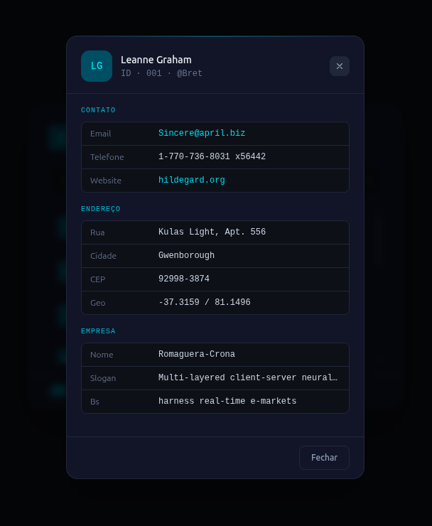

# Users List

> Aplicação web para buscar e visualizar usuários consumindo a API pública [JSONPlaceholder](https://jsonplaceholder.typicode.com/).

Inclui busca com debounce, listagem filtrada e modal com detalhes completos do usuário selecionado.

---

## Stack

| Categoria | Tecnologia |
|-----------|------------|
| UI | [React](https://react.dev/) v19 |
| Linguagem | [TypeScript](https://www.typescriptlang.org/) |
| Build / Dev server | [Vite](https://vite.dev/) |
| Estilização | [Tailwind CSS](https://tailwindcss.com/) + PostCSS + Autoprefixer |
| Qualidade de código | [ESLint](https://eslint.org/) v9, `typescript-eslint`, plugins React |
| Editor | [Cursor](https://cursor.com/) |

---

## Pré-requisitos

- [Node.js](https://nodejs.org/) (versão LTS recomendada)
- npm (incluído com o Node)

---

## Instalação e uso

```bash
# Clone o repositório
git clone <url-do-repositorio>
cd users-list

# Instale as dependências
npm install

# Inicie o servidor de desenvolvimento
npm run dev
```

O Vite exibirá no terminal a URL local — por padrão [`http://localhost:5173`](http://localhost:5173).

---

## Scripts disponíveis

| Comando | Descrição |
|---------|-----------|
| `npm run dev` | Servidor de desenvolvimento com HMR |
| `npm run build` | Checagem TypeScript (`tsc -b`) + build de produção |
| `npm run preview` | Pré-visualização local do build de produção |
| `npm run lint` | Executa o ESLint no projeto |

---

## Estrutura do projeto

```
src/
├── assets/          # Imagens e recursos estáticos
├── components/      # Componentes reutilizáveis (ex: UserModal)
├── hooks/           # Hooks customizados (debounce, clique fora, busca de usuários)
├── pages/
│   └── App/         # Página principal — estado da busca e composição da UI
├── services/        # Chamadas à API (JSONPlaceholder)
├── types/           # Tipos TypeScript compartilhados
└── utils/           # Funções utilitárias (ex: filtragem de usuários)
```

---

## Funcionalidades

- **Busca com debounce** — evita requisições excessivas enquanto o usuário digita
- **Listagem filtrada** — exibe apenas os usuários correspondentes ao termo buscado
- **Modal de detalhes** — ao selecionar um usuário, exibe nome, contato, endereço e dados da empresa
- **Fechar com clique fora** — tanto a lista quanto o modal fecham ao clicar fora da área

---

## Preview

<p align="center">
  
  <br/><br/>
  
  <br/><br/>
  
</p>