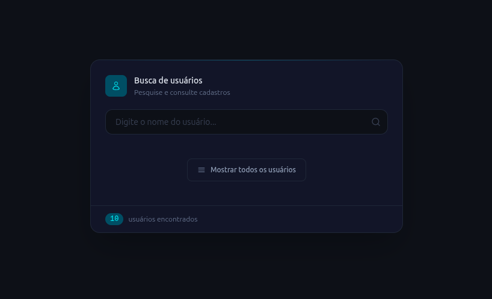
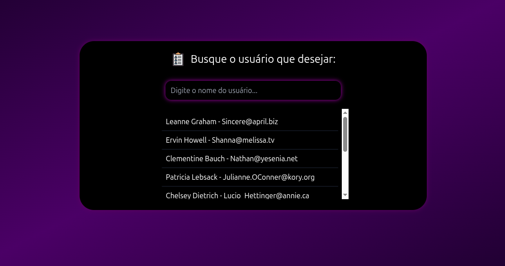

# Users List

Aplicação web para buscar e visualizar usuários consumindo a API pública [JSONPlaceholder](https://jsonplaceholder.typicode.com/). Inclui busca com debounce, listagem filtrada e modal com detalhes do usuário selecionado.

## Stack e ferramentas

| Categoria | Tecnologia |
|-----------|------------|
| **UI** | [React](https://react.dev/) v.19 |
| **Linguagem** | [TypeScript](https://www.typescriptlang.org/) |
| **Build e dev server** | [Vite](https://vite.dev/) |
| **Estilização** | [Tailwind CSS](https://tailwindcss.com/) (com PostCSS e Autoprefixer) |
| **Qualidade de código** | [ESLint](https://eslint.org/) v.9, `typescript-eslint`, plugins React |
| **Ambiente de desenvolvimento** | [Cursor](https://cursor.com/) (editor com assistência por IA para implementação e refatoração) |

## Pré-requisitos

- [Node.js](https://nodejs.org/) (versão LTS recomendada)
- npm (incluído com o Node)

## Como rodar o projeto

Clone o repositório, instale as dependências e inicie o servidor de desenvolvimento:

```bash
npm install
npm run dev
```

O Vite exibirá no terminal a URL local (por padrão `http://localhost:5173/`). Abra esse endereço no navegador para usar a aplicação.

## Outros scripts

| Comando | Descrição |
|---------|-----------|
| `npm run dev` | Servidor de desenvolvimento com hot module replacement (HMR) |
| `npm run build` | Verificação TypeScript (`tsc -b`) e build de produção |
| `npm run preview` | Pré-visualização local do build de produção |
| `npm run lint` | Executa o ESLint no projeto |

## Estrutura resumida

- `src/pages/App` — página principal, estado da busca e composição da UI
- `src/components` — componentes reutilizáveis (ex.: modal)
- `src/hooks` — hooks de dados e utilitários (ex.: debounce, clique fora)
- `src/services` — chamadas à API
- `src/types` — tipos TypeScript compartilhados

## Preview

<p align="center">
  
  
</p>

